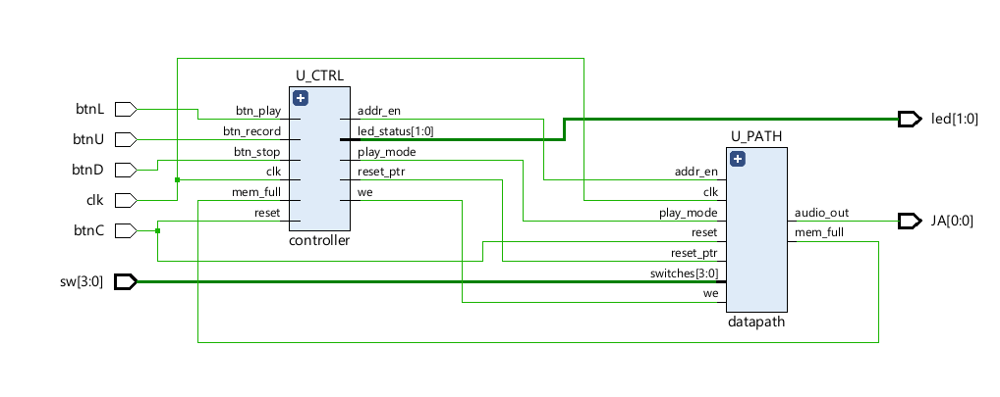

# Piano
FPGA Digital Piano Synthesizer (VHDL)
# FPGA Polyphonic Digital Piano 🎹

A fully functional, real-time digital synthesizer implemented in **VHDL** on a **Basys 3 FPGA** (Xilinx Artix-7). 

This project demonstrates hardware logic design, precise frequency generation, and memory management for audio signal processing.

[![Watch the Demo Video]
https://youtu.be/77ka91aeLu8
> *Click the image above to watch the demo (sound on! 🔊)*

---

## 🚀 Key Features

* **Polyphony Support:** Capable of playing multiple notes simultaneously (signal superposition).
* **Custom Sound Synthesis:** Generates audio waves using precise clock division logic (no external audio IPs used).
* **Record & Playback:** Implements a recording system using the FPGA's **Block RAM** to store and replay user melodies.
* **Real-Time Interaction:** Zero-latency response mapped to the Basys 3 switches/buttons.

## 🛠️ Hardware & Tools

* **Board:** Digilent Basys 3 (Xilinx Artix-7 FPGA).
* **Language:** VHDL (IEEE 1076).
* **IDE:** Xilinx Vivado Design Suite.
* **Output:** Pmod I2S / PWM Audio Output (3.5mm Jack).

## 🏗️ System Architecture

The design is modular, focusing on synchronous logic and efficient resource utilization.

### High-Level Block Diagram

*(RTL Analysis generated via Vivado)*

### Core Modules:
1.  **Frequency Divider:** Takes the 100MHz master clock and divides it down to specific frequencies for each musical note (Do, Re, Mi...).
2.  **Note Controller:** Maps physical inputs (switches) to the corresponding frequency signals.
3.  **Mixer (Polyphony):** Adds multiple signal waves mathematically to allow simultaneous key presses without signal collision.
4.  **Memory Controller (FSM):** A Finite State Machine that manages the Write/Read states for the Record/Playback feature using Block RAM.

## 💻 How to Run

1.  Clone this repository.
2.  Open the project file (`.xpr`) in **Vivado**.
3.  Run **Synthesis** and **Implementation**.
4.  Generate the **Bitstream**.
5.  Program the device via USB.
6.  Connect headphones/speaker to the audio output.

**Author:** [Gonzalo Ripoll Chanclon]  
**Contact:** [Enlace a tu LinkedIn]
